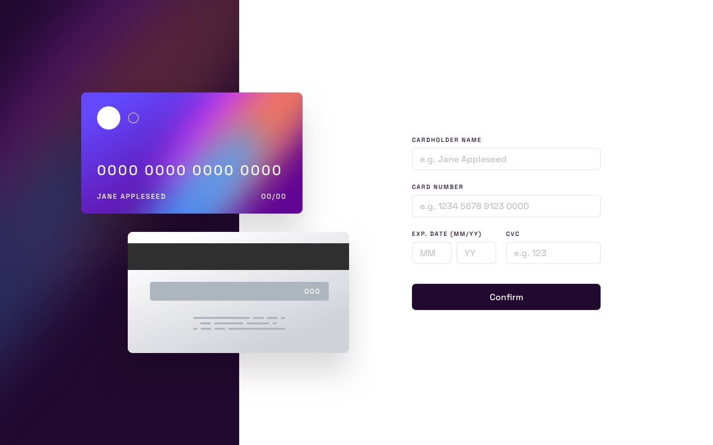
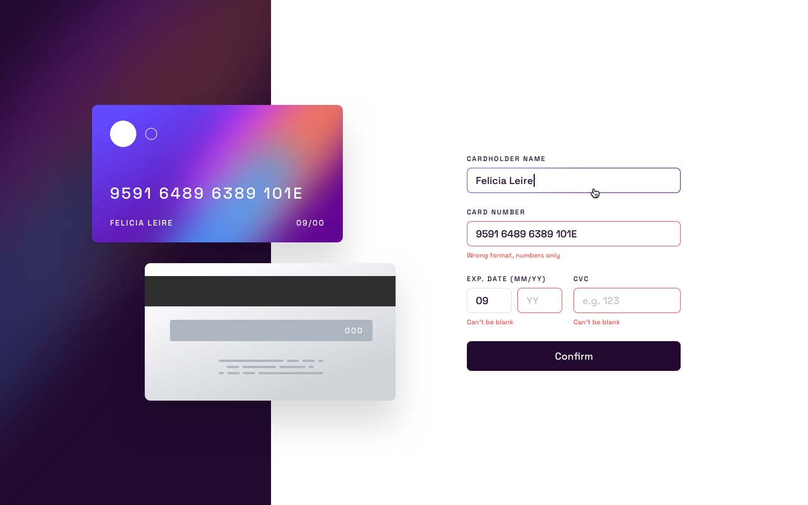
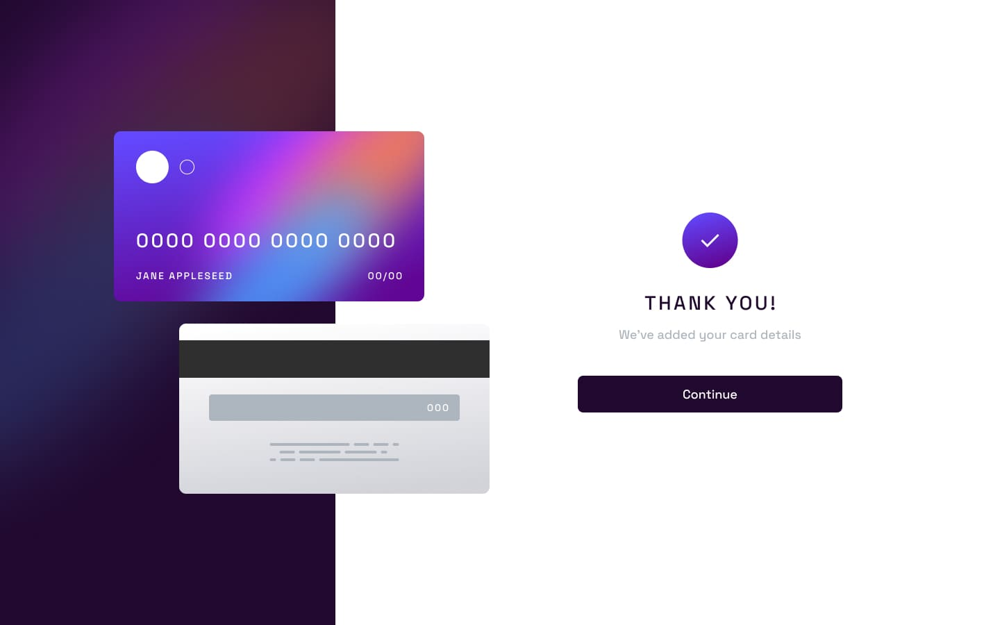
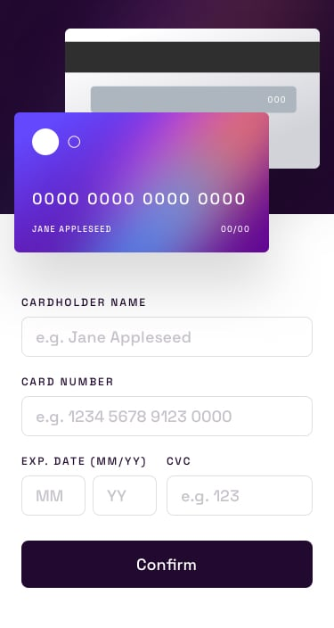
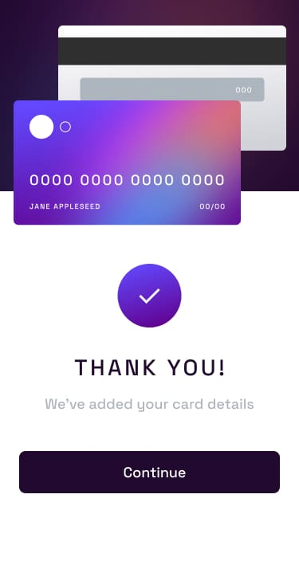

# Frontend Mentor - Solución del formulario interactivo de tarjeta

Esta es mi solución al reto **Interactive Card Details Form** de Frontend Mentor. Creé un formulario adaptable a distintos tamaños de pantalla con React, Tailwind CSS y Motion. Mientras el usuario escribe sus datos, la parte frontal y trasera de la tarjeta se actualizan en tiempo real.

---

## Tabla de contenidos

- [Resumen](#resumen)
- [El reto](#el-reto)
- [Diseño](#diseño)
- [Enlaces](#enlaces)
- [Mi proceso](#mi-proceso)
- [Tecnologías utilizadas](#tecnologías-utilizadas)
- [Lo que aprendí](#lo-que-aprendí)

---

## Resumen

La página contiene un formulario para el nombre del titular, número de tarjeta, fecha de vencimiento y CVC. La vista previa de la tarjeta se actualiza al cambiar cada campo, y el número se muestra en grupos de cuatro dígitos.

El formulario muestra mensajes de error cuando hay campos vacíos o datos no válidos. Después de un envío válido, aparece un mensaje de confirmación con un botón **Continue** para volver al formulario. Motion se encarga de las animaciones sutiles de entrada y respeta la preferencia del usuario de reducir el movimiento.

**Implementación actual:** este proyecto es una demostración de interfaz. No procesa pagos, no envía los datos de la tarjeta a un servidor ni almacena la información ingresada.

---

## El reto

Los usuarios deben poder:

- Ver una interfaz adaptable a pantallas móviles y de escritorio.
- Introducir los datos de la tarjeta y ver cómo se actualiza la vista previa en tiempo real.
- Ver mensajes de validación y bordes rojos cuando un campo contiene un error.
- Enviar un formulario válido y ver un mensaje de confirmación.
- Volver al formulario mediante el botón **Continue**.
- Ver un borde con gradiente al enfocar un campo válido.

---

## Diseño

Las siguientes imágenes son las referencias de diseño proporcionadas para el reto, no capturas de la implementación final.

### Diseño de escritorio



### Estados activos



### Estado de confirmación



### Diseño móvil





---

## Enlaces

- Proyecto en línea: [Interactive Card Form](https://mlopezl.github.io/interactive-card-form-info/)
- Repositorio: [Interactive Card Form en GitHub](https://github.com/mlopezl/interactive-card-form-info)

---

## Mi proceso

Dividí la interfaz en componentes para la tarjeta y el formulario. La aplicación principal mantiene los valores del formulario en el estado de React y los pasa tanto a los campos como a la vista previa de la tarjeta.

El formulario utiliza campos controlados. Da formato al número de tarjeta mientras el usuario escribe y comprueba los valores necesarios antes de mostrar el mensaje de confirmación. Los estados de error controlan los mensajes de validación y los colores de los bordes.

Usé Tailwind CSS para el diseño adaptable y los colores personalizados. Un gradiente de CSS crea el borde de los campos enfocados. Motion añade una breve animación de entrada al formulario y al mensaje de confirmación, respetando la configuración de movimiento reducido.

### Ejecutar localmente

Inicia el servidor de desarrollo:

```bash
pnpm run dev
```

Abre la dirección local que muestra Vite.

### Validar y generar el build

```bash
pnpm run lint
pnpm run build
```

Vite genera los archivos de producción en `docs`. Para previsualizar el build localmente:

```bash
pnpm run preview
```

---

## Tecnologías utilizadas

- React
- JavaScript y JSX
- Tailwind CSS v4
- Propiedades personalizadas y gradientes de CSS
- Motion para React
- Vite
- PNPM
- ESLint
- GitHub Pages

---

## Lo que aprendí

- Gestionar campos controlados mediante el estado de React.
- Compartir valores entre el formulario y una vista previa de la tarjeta en tiempo real.
- Dar formato a un campo mientras el usuario escribe.
- Validar campos obligatorios y mostrar errores específicos para cada uno.
- Usar renderizado condicional para alternar entre el formulario y el mensaje de confirmación.
- Crear un borde con gradiente mediante capas de fondo en CSS.
- Añadir animaciones sutiles que respetan la preferencia de movimiento reducido.
- Crear diseños adaptables con Tailwind CSS.
- Configurar Vite para publicar el proyecto desde la carpeta `docs` mediante GitHub Pages.